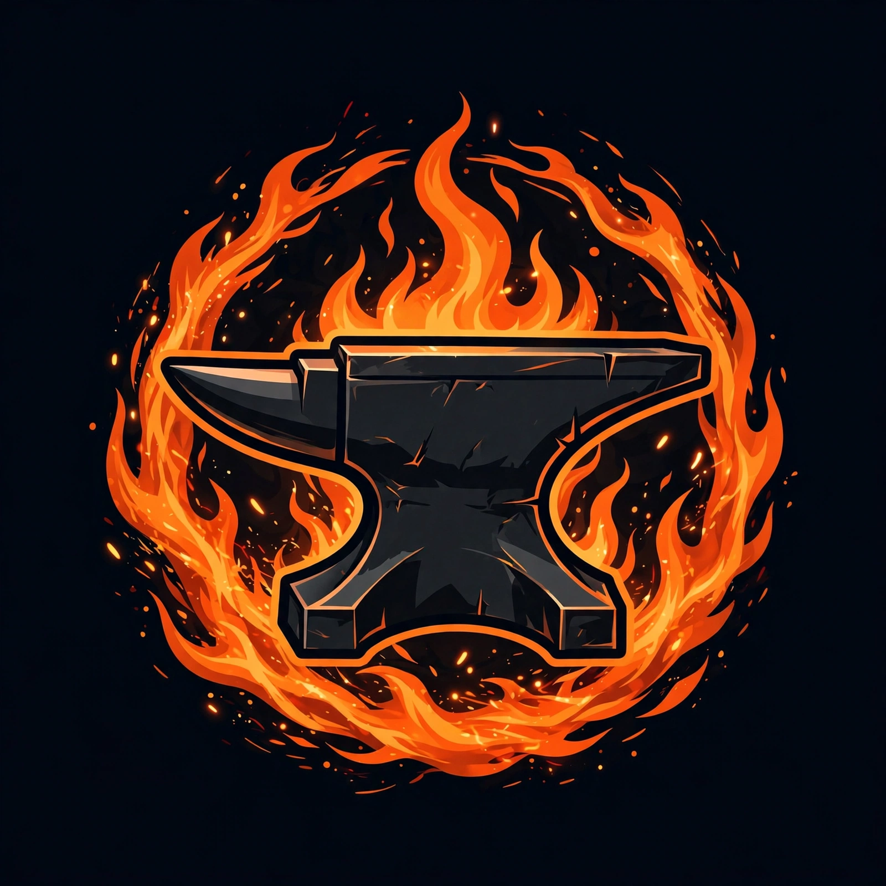

<p align="center">
  
</p>

<h1 align="center">ForgeCore</h1>

<p align="center"><i>The all-in-one essentials suite for Paper — 235 original commands across teleport, moderation, economy, player systems, world admin, portals, holograms, ranks, flight charges, schedules and network tools.</i></p>

<p align="center">
  
  
  
  
  
  
</p>

<p align="center"><sub>Not affiliated with <a href="https://minecraftforge.net">MinecraftForge</a> — "Forge" is just a name.</sub></p>

---

Everything a survival or network server needs in one jar: homes, warps, RTP and a full TPA system; bans, mutes, jails, vanish and maintenance mode; a YAML-backed economy with cheques, kits and votes; nicknames, private messaging, personal time/weather; world tools (chunk repair, block scan/replace, NBT inspection, EssentialsX import); plus the big systems — **portals** with particles and BungeeCord destinations, **holograms**, **dynamic signs**, **mirror building**, an **armor-stand editor GUI**, **interactive commands**, item-attached commands, a command-alias editor, a stat-based **rank ladder**, **boss bars**, a full **BungeeCord suite**, an **animated tablist**, **flight charges**, **playtime reward schedules**, **elevators**, and more.

An original implementation written from scratch for Paper 26.3. Zero runtime dependencies beyond the Paper API. No deprecated API usage — the build fails on any deprecation warning.

## Feature highlights

- **Teleport suite** — homes (per-player limits), warps, spawn/first-spawn, `/back` & `/dback`, TPA requests with accept/deny/toggle/bypass, `/rtp` with per-world centers, compass pointing, LuckPerms-aware `/group`
- **Moderation** — temp/perma bans (offline-capable), mutes, global chat mute, silencing, jails with return locations, IP lock, vanish, patrol mode, maintenance mode with bypass list, player-data purge
- **Economy** — balances, `/baltop`, player-to-player pay, admin give/take/set, redeemable **cheques**, sell/worth/condense, kits with cooldowns and costs, vote tracking
- **Player systems** — fly/god/heal/feed, exp, effects, enchants (with server-wide disable list), item rename/lore/unbreakable, nicknames, personal time & weather, playtime tracking, mob-aggro toggle, cuffing, totem-from-inventory
- **Portals** — 3×3 pads with custom particles, per-portal command lists, destinations, and BungeeCord cross-server jumps
- **Holograms** — TextDisplay-based, PlaceholderAPI-aware, auto-refreshing
- **Dynamic signs** — signs whose lines re-render from placeholders on an interval; sign copy/paste
- **Mirror building** — 11 mirror modes for symmetric construction
- **Ranks** — configurable ladder with playtime/money/kill requirements, reward commands, optional auto-promotion
- **Flight charges** — pay-for-flight drained per minute, topped up with money or XP
- **Schedules** — event-driven actions (first join, join, quit, death, respawn, teleport) plus interval and playtime-milestone triggers
- **Network** — `/server`, `/sendall`, cross-network broadcast, server list via the BungeeCord channel
- **Importers** — EssentialsX userdata/warps/kits import, legacy user-folder import

## Commands

Every command defaults to permission `forgecore.<name>` (see [Permissions](#permissions) for the extras). Aliases are shown in parentheses.

## Merged plugins

The six standalone Forge plugins have been merged into ForgeCore, keeping the more advanced implementation wherever features overlapped:

- **forge-tablist** — animated tablist now uses Adventure's non-deprecated `Audience#sendPlayerListHeaderAndFooter`; per-group tab names (permission-based prefix/suffix wrapped around nicks) and the animated server-list MOTD were merged in.
- **forge-playtime** — milestone reward system merged (`/playtimerewards` GUI with claimed/available/locked states, one-time console-command rewards); playtime tracking itself stays on ForgeCore's unified tracker.
- **forge-announcer** — full announcer engine merged (`/announce`): per-announcement intervals, chat/action-bar/boss-bar/title delivery, sequential/random rotation, broadcast-by-id.
- **forge-chat** — channels (global/local/staff via `/ch`, `/g`, `/l`), @mentions, anti-spam, word filter, permission-group formatting, hover cards, per-channel slowmode merged; `/msg` was upgraded in place with group formatting and PM templates.
- **forge-stack** — entity, item and XP-orb stacking plus spawner stacking (`/stack`) merged wholesale.
- **forge-items** — the entire custom-item system merged (`/fitems`): YAML items, 25 activators, 25 action verbs, mana, item levels/XP, drop tables, sets, recipes, in-game GUI editor and browser GUI.

### Core (1)

| Command | Description | Usage |
|---|---|---|
| `/forgecore` (/fc) | ForgeCore plugin info and command help. | `/forgecore help [page|command]` |

### Teleport (35)

| Command | Description | Usage |
|---|---|---|
| `/back` | Teleport back to your previous location. | `/back` |
| `/dback` | Teleport back to your death location. | `/dback` |
| `/editwarp` | Move a warp to your current location. | `/editwarp <name>` |
| `/group` (/groups) | Show a player's permission groups. | `/group [player]` |
| `/home` | Teleport to one of your homes. | `/home [name]` |
| `/homes` | List homes (yours, or another player's with permission). | `/homes [player]` |
| `/jump` | Teleport to the block you are looking at. | `/jump` |
| `/launch` | Launch yourself (or another player) into the air. | `/launch [player]` |
| `/list` (/who, /online) | List online players. | `/list` |
| `/near` | List players near you with distances. | `/near [radius]` |
| `/point` | Point your compass at a player or coordinates. | `/point <player|x y z>` |
| `/pos` (/getpos, /coords) | Show your coordinates (or another player's). | `/pos [player]` |
| `/removehome` (/delhome) | Delete one of your homes. | `/removehome <name>` |
| `/removewarp` (/delwarp) | Delete a server warp. | `/removewarp <name>` |
| `/rtp` | Teleport to a random safe location. | `/rtp [world]` |
| `/setfirstspawn` | Set the first-join spawn location. | `/setfirstspawn` |
| `/sethome` | Set a home at your current location. | `/sethome <name>` |
| `/setrt` | Set this world's random-teleport center and radius. | `/setrt [radius]` |
| `/setspawn` | Set this world's spawn to your location. | `/setspawn` |
| `/setwarp` | Create a server warp at your location. | `/setwarp <name>` |
| `/spawn` | Teleport to the world spawn. | `/spawn [player]` |
| `/top` | Teleport to the highest block at your position. | `/top` |
| `/tp` (/teleport) | Teleport to a player, or teleport one player to another. | `/tp <player> [target]` |
| `/tpa` | Request to teleport to another player. | `/tpa <player>` |
| `/tpaall` | Request every online player to teleport to you. | `/tpaall` |
| `/tpaccept` | Accept a pending teleport request. | `/tpaccept` |
| `/tpahere` | Request another player to teleport to you. | `/tpahere <player>` |
| `/tpall` | Teleport every online player to one player. | `/tpall <player>` |
| `/tpallworld` | Teleport every online player to a world's spawn. | `/tpallworld <world>` |
| `/tpbypass` | Toggle ignoring players who disabled teleport requests. | `/tpbypass` |
| `/tpdeny` | Deny a pending teleport request. | `/tpdeny` |
| `/tphere` (/s) | Teleport a player to your location. | `/tphere <player>` |
| `/tppos` | Teleport to coordinates (use ~ for relative). | `/tppos <x> <y> <z> [world]` |
| `/tptoggle` | Toggle accepting teleport requests. | `/tptoggle` |
| `/warp` | Teleport to a server warp. | `/warp <name>` |

### Moderation (36)

| Command | Description | Usage |
|---|---|---|
| `/alert` | Broadcast a styled alert to everyone. | `/alert <message...>` |
| `/ban` | Permanently ban a player. | `/ban <player> [reason...]` |
| `/broadcast` (/bc) | Broadcast a message to the whole server. | `/broadcast <message...>` |
| `/checkaccount` | Show a player's last IP and accounts sharing it. | `/checkaccount <player>` |
| `/checkban` | Show a player's ban details. | `/checkban <player>` |
| `/clearchat` | Clear chat for all players. | `/clearchat` |
| `/commandspy` | Toggle seeing the commands other players run. | `/commandspy` |
| `/helpop` (/hop) | Request help from online staff. | `/helpop <message...>` |
| `/inv` | Open another player's live inventory. | `/inv <player>` |
| `/invcheck` | View another player's inventory (read-only). | `/invcheck <player>` |
| `/jail` | Jail a player. | `/jail <player> [jail]` |
| `/jailedit` | Create, delete or list jails. | `/jailedit <create|delete|list> [name]` |
| `/kick` | Kick a player from the server. | `/kick <player> [reason...]` |
| `/lastonline` | Show when a player was last online. | `/lastonline <player>` |
| `/lockip` | Toggle locking a player's account to their current IP. | `/lockip <player>` |
| `/maintenance` | Toggle maintenance mode. | `/maintenance` |
| `/maxplayer` | Set the maximum player count. | `/maxplayer <amount>` |
| `/mute` | Mute a player (optional duration, forever by default). | `/mute <player> [duration] [reason...]` |
| `/mutechat` | Toggle muting chat server-wide. | `/mutechat` |
| `/oplist` | List the server operators. | `/oplist` |
| `/patrol` | Toggle patrol mode (visit every online player, 10s apart). | `/patrol` |
| `/purge` | Delete userdata of players inactive for the given days. | `/purge <days>` |
| `/removeuser` | Delete a player's userdata (must be offline). | `/removeuser <player>` |
| `/saveall` | Save all worlds and plugin data. | `/saveall` |
| `/seen` | Show information about a player. | `/seen <player>` |
| `/silence` | Toggle total silence for a player (blocks all outgoing messages). | `/silence <player>` |
| `/smite` | Strike lightning at a player (or where you look). | `/smite [player]` |
| `/socialspy` | Toggle seeing other players' private messages. | `/socialspy` |
| `/staffmsg` (/sm) | Send a message to all online staff. | `/staffmsg <message...>` |
| `/sudo` | Force a player to run a command (or say text with 'c '). | `/sudo <player> <command...>  (use 'c <text>' to make them chat)` |
| `/tempban` | Temporarily ban a player. | `/tempban <player> <duration> [reason...]` |
| `/unban` | Unban a player. | `/unban <player>` |
| `/unjail` | Release a player from jail. | `/unjail <player>` |
| `/vanish` | Toggle vanish (invisible to players without forgecore.vanish.see). | `/vanish` |
| `/vanishedit` | Toggle vanish for another player. | `/vanishedit <player>` |
| `/whowas` | Look up a player by a name they have used before. | `/whowas <name>` |

### Economy (17)

| Command | Description | Usage |
|---|---|---|
| `/balance` (/bal) | Show a player's balance. | `/balance [player]` |
| `/baltop` | Show the richest players. | `/baltop [page]` |
| `/cheque` | Withdraw money into a paper cheque (right-click to redeem). | `/cheque <amount>` |
| `/condense` | Convert sets of 9 items into blocks. | `/condense` |
| `/generateworth` | Fill missing sell prices with default values. | `/generateworth` |
| `/kit` | List kits, or claim a kit. | `/kit [name]` |
| `/kitcdreset` | Reset a player's kit cooldowns. | `/kitcdreset <player> [kit]` |
| `/kiteditor` | Create or edit kits from your inventory. | `/kiteditor <create|delete|update|list> <name> [cooldown] [cost]` |
| `/money` | Check your balance, pay players, or manage balances (admin). | `/money [pay <player> <amount> | <give|take|set> <player> <amount>]` |
| `/sell` | Sell the held item stack, or all sellable items. | `/sell [hand|all]` |
| `/setworth` | Set the sell price of the held item's material. | `/setworth <price>` |
| `/uncondense` | Convert blocks back into their 9 raw items. | `/uncondense` |
| `/voteedit` | Add, set or take votes from a player. | `/voteedit <add|set|take> <player> <amount>` |
| `/votes` | Show a player's vote count. | `/votes [player]` |
| `/votetop` | Show the top voters. | `/votetop` |
| `/worth` | Show the sell price of the held item. | `/worth` |
| `/worthlist` | List items that have a sell price. | `/worthlist [page]` |

### Player: self & state (42)

| Command | Description | Usage |
|---|---|---|
| `/afk` | Toggle AFK status. | `/afk` |
| `/air` | Refill your air supply. | `/air [player]` |
| `/checkexp` | Show experience details. | `/checkexp [player]` |
| `/cplaytime` | Show this session's playtime. | `/cplaytime [player]` |
| `/cuff` | Cuff a player so they cannot move. | `/cuff <player>` |
| `/disableenchant` | Toggle a server-wide disabled enchantment. | `/disableenchant <enchantment>` |
| `/effect` | Apply or clear potion effects. | `/effect <player> <effect|clear> [duration-sec] [amplifier]` |
| `/enchant` | Enchant the held item. | `/enchant <enchantment> [level]` |
| `/exp` | Give experience (suffix L for levels). | `/exp <amount>[L] [player]` |
| `/feed` | Restore hunger and saturation. | `/feed [player]` |
| `/fly` | Toggle flight. | `/fly [player]` |
| `/flyspeed` | Set flight speed (0-10). | `/flyspeed <0-10> [player]` |
| `/glow` | Toggle the glowing outline. | `/glow [player]` |
| `/god` | Toggle god mode. | `/god [player]` |
| `/hat` | Wear the held item as a hat. | `/hat` |
| `/head` | Get a player head. | `/head [player]` |
| `/heal` | Fully heal yourself or another player. | `/heal [player]` |
| `/hideflags` | Toggle hidden item flags on the held item. | `/hideflags` |
| `/hunger` | Set food level (0-20). | `/hunger <0-20> [player]` |
| `/iteminfo` | Show details of the held item. | `/iteminfo` |
| `/itemlore` | Edit the held item's lore. | `/itemlore <add|set|clear|remove> [text...]` |
| `/itemname` | Rename the held item. | `/itemname <name...>` |
| `/itemnbt` | Inspect the held item's data. | `/itemnbt` |
| `/maxhp` | Set max health (1-1024). | `/maxhp <amount> [player]` |
| `/more` | Fill the held stack to max size. | `/more` |
| `/nick` | Set a nickname (off to clear). | `/nick [player] <nick|off>` |
| `/ping` | Show connection ping. | `/ping [player]` |
| `/playtime` | Show total playtime. | `/playtime [player]` |
| `/playtimetop` | Show the top playtimes. | `/playtimetop` |
| `/ptime` | Set your personal time. | `/ptime <day|noon|night|midnight|<ticks>|reset> [player]` |
| `/pweather` | Set your personal weather. | `/pweather <clear|rain|reset> [player]` |
| `/repair` | Repair the held item (or all items). | `/repair [all]` |
| `/repaircost` | Show the cost of repairing the held item. | `/repaircost` |
| `/saturation` | Set saturation (0-20). | `/saturation <0-20> [player]` |
| `/shakeitoff` | Clear effects, fire and freeze. | `/shakeitoff` |
| `/tagtoggle` | Toggle your name tag visibility. | `/tagtoggle` |
| `/tfly` | Toggle flight for another player. | `/tfly <player>` |
| `/tgod` | Toggle god mode for another player. | `/tgod <player>` |
| `/tmb` | Toggle whether mobs target you. | `/tmb` |
| `/toggleshiftedit` | Toggle shift-right-click sign editing. | `/toggleshiftedit` |
| `/toggletotem` | Toggle totem auto-use from your inventory. | `/toggletotem` |
| `/unbreakable` | Toggle unbreakable on the held item. | `/unbreakable` |

### Player: social & fun (38)

| Command | Description | Usage |
|---|---|---|
| `/actionbarmsg` | Send an action-bar message to a player or everyone (*). | `/actionbarmsg <player|*> <message...>` |
| `/book` | Create a signed written book (|| forces a page break). | `/book <title> <text...>` |
| `/checkperm` | Test whether you have a permission node. | `/checkperm <permission>` |
| `/clearender` | Clear an ender chest. | `/clearender [player]` |
| `/colorlimits` | Show which chat colors your rank may use. | `/colorlimits` |
| `/colors` | Show the color and format tags you can use in chat. | `/colors` |
| `/compass` | Show your compass target, or track a player with it. | `/compass [player]` |
| `/ctext` | Display a custom text created with /editctext. | `/ctext <name>` |
| `/dispose` | Open a trash GUI; items left inside are deleted. | `/dispose` |
| `/editctext` | Create, edit and delete custom texts for /ctext. | `/editctext <create|delete|set|list|info> <name> [text...]` |
| `/ender` (/enderchest, /ec) | Open an ender chest (yours, or another player's). | `/ender [player]` |
| `/getbook` | Receive a book and quill. | `/getbook` |
| `/haspermission` | Test whether a player has a permission node. | `/haspermission <player> <permission>` |
| `/ignore` | Toggle ignoring a player. | `/ignore <player>` |
| `/info` | Show server information. | `/info` |
| `/me` | Broadcast an emote: * <name> <message>. | `/me <message...>` |
| `/msg` (/tell, /w, /pm) | Send a private message to a player. | `/msg <player> <message...>` |
| `/note` | Keep personal notes. | `/note <add|list|delete|clear> [text...]` |
| `/placeholders` | List ForgeCore's built-in placeholders. | `/placeholders` |
| `/preview` | Read-only preview of another player's ender chest. | `/preview <player>` |
| `/recipe` | Show the crafting recipe for an item. | `/recipe <item>` |
| `/reply` (/r) | Reply to your last private-message partner. | `/reply <message...>` |
| `/ride` | Ride the entity you are looking at; run again to dismount. | `/ride` |
| `/servertime` | Show the world time and the real server time. | `/servertime` |
| `/sit` | Sit down; move or run /sit again to stand up. | `/sit` |
| `/sound` | Play a sound at a player (namespaced key, e.g. minecraft:entity.player.levelup). | `/sound <sound> [player]` |
| `/stats` | Show a player's vanilla statistics summary. | `/stats [player]` |
| `/statsedit` | Set an untyped vanilla statistic for a player. | `/statsedit <player> <stat> <value>` |
| `/status` | Show server status: TPS, memory, uptime, players. | `/status` |
| `/suicide` | Kill yourself. | `/suicide` |
| `/time` | Set the time of a world. | `/time <day|noon|night|midnight|ticks> [world]` |
| `/titlemsg` | Send a title to a player or everyone (*); subtitle after " | ". | `/titlemsg <player|*> <title> [| <subtitle>]` |
| `/tree` | Grow a tree at the block you are looking at. | `/tree [type]` |
| `/version` | Show the ForgeCore and server platform versions. | `/version` |
| `/walkspeed` (/wspeed) | Set walk speed from 0 to 10 (2 is normal). | `/walkspeed <0-10> [player]` |
| `/weather` | Set the weather of a world. | `/weather <clear|rain|thunder> [world]` |
| `/workbench` | Open a portable crafting table. | `/workbench` |

### Admin & world (33)

| Command | Description | Usage |
|---|---|---|
| `/blockcycling` | Toggle right-click block variant cycling. | `/blockcycling` |
| `/blockinfo` | Show info about the block you are looking at. | `/blockinfo` |
| `/blocknbt` | Dump the looked-at block's tile-entity data. | `/blocknbt` |
| `/clear` (/ci) | Clear an inventory, optionally one material. | `/clear [player] [material]` |
| `/entityinfo` | Show info about the entity you are looking at. | `/entityinfo` |
| `/entitynbt` | Dump the looked-at entity's persistent data. | `/entitynbt` |
| `/fixchunk` | Unload and reload your current chunk from disk. | `/fixchunk` |
| `/give` | Give items to a player. | `/give <player> <item> [amount]` |
| `/giveall` | Give items to all online players. | `/giveall <item> [amount]` |
| `/gm` (/gamemode) | Change gamemode. | `/gm <0|1|2|3|survival|creative|adventure|spectator> [player]` |
| `/groundclean` (/gc) | Remove dropped items and arrows in a radius. | `/groundclean [radius]` |
| `/ifoffline` | Run a command as console if the player is offline. | `/ifoffline <player> <command...>` |
| `/ifonline` | Run a command as console if the player is online. | `/ifonline <player> <command...>` |
| `/importfrom` | Import data from another plugin (essentials). | `/importfrom <essentials>` |
| `/importoldusers` | Import userdata-style yml files from a folder. | `/importoldusers <folder>` |
| `/invlist` | List saved inventory snapshots. | `/invlist [player]` |
| `/invload` | Restore a saved inventory. | `/invload <name> [player]` |
| `/invremove` | Delete a saved inventory snapshot. | `/invremove <name>` |
| `/invsave` | Save your current inventory under a name. | `/invsave <name>` |
| `/lfix` | Resend your current chunk (fixes lighting glitches). | `/lfix` |
| `/migratedatabase` | Scan for legacy ForgeCore data formats and convert them. | `/migratedatabase` |
| `/reload` | Reload ForgeCore's config.yml. | `/reload` |
| `/replaceblock` | Replace blocks of one material with another around you. | `/replaceblock <from-material> <to-material> [radius]` |
| `/scan` | Count blocks of a material nearby; report the nearest. | `/scan <material> [radius]` |
| `/se` (/signedit) | Set a line on the sign you are looking at. | `/se <line 1-4> <text...>` |
| `/search` | Find containers holding a material nearby. | `/search <material> [radius]` |
| `/setmotd` | Set the server MOTD (MiniMessage supported). | `/setmotd <text...>` |
| `/silentchest` | Toggle your quiet-container preference. | `/silentchest` |
| `/spawner` | Set the entity type of the spawner you are looking at. | `/spawner <entity-type>` |
| `/spawnmob` | Spawn mobs at your target block or at a player. | `/spawnmob <entity-type> [amount] [player]` |
| `/tps` | Show server TPS. | `/tps` |
| `/unloadchunks` | Force-unload chunks with no players nearby (may hitch). | `/unloadchunks [world]` |
| `/usermeta` | Get, set, remove or list raw userdata keys. | `/usermeta <player> <get|set|remove|list> [key] [value]` |

### Systems A (9)

| Command | Description | Usage |
|---|---|---|
| `/aliaseditor` | Create and manage custom command aliases. | `/aliaseditor <create|delete|list> <alias> [command...]` |
| `/armorstand` (/asedit) | Open the armor stand editor for the nearest armor stand. | `/armorstand` |
| `/attachcommand` (/attachcmd) | Attach a command to the held item (or clear it). | `/attachcommand [command...]` |
| `/dsign` | Turn the targeted sign into a self-updating dynamic sign. | `/dsign <create|delete|list> [name]` |
| `/hologram` | Create and manage floating text holograms. | `/hologram <create|delete|addline|setline|removeline|list|movehere> <name> [text...]` |
| `/ic` | Bind clickable commands to blocks or entities. | `/ic <create|delete|list|addcmd|delcmd|info> <name> [args...]` |
| `/mirror` | Mirror your block placements across a symmetry mode. | `/mirror <start|stop|mode> [mode]` |
| `/portals` | Create and manage portal pads with destinations, commands and particles. | `/portals <create|delete|list|info|setdest|addcmd|delcmd|setparticle|setserver> <name> [args...]` |
| `/sc` | Toggle sign copy/paste mode. | `/sc` |

### Systems B (16)

| Command | Description | Usage |
|---|---|---|
| `/bbroadcast` | Broadcast a message across the BungeeCord network. | `/bbroadcast <message...>` |
| `/bossbarmsg` | Show a timed boss bar message. | `/bossbarmsg <player|*> <seconds> <message...>` |
| `/charges` | Show flight charges. | `/charges [player]` |
| `/counter` | Show your session counters. | `/counter [reset]` |
| `/flightcharge` | Manage flight charges. | `/flightcharge <add|take|set|show|expcharge|moneycharge|recharge> <player> [amount]` |
| `/rankdown` | Drop down one rank on the ladder. | `/rankdown` |
| `/rankinfo` | Show a rank's requirements and rewards. | `/rankinfo [rank]` |
| `/ranklist` | Show the rank ladder and requirements. | `/ranklist` |
| `/rankset` | Set a player's rank directly. | `/rankset <player> <rank>` |
| `/rankup` | Rank up when you meet the next rank's requirements. | `/rankup` |
| `/schedule` | List, inspect and run schedules. | `/schedule <list|run|info> [name]` |
| `/sendall` | Send all online players to another server. | `/sendall <server>` |
| `/server` | Switch BungeeCord servers. | `/server [server] [player]` |
| `/serverlist` | List the servers on the BungeeCord network. | `/serverlist` |
| `/tablistupdate` | Force-refresh the animated tablist and player tab entries. | `/tablistupdate` |
| `/viewrange` | Show or set a world's view distance. | `/viewrange [range] [world]` |

### Merged: playtime milestones (1)

| Command | Description | Usage |
|---|---|---|
| `/playtimerewards` (/prewards, /milestones) | Open the playtime milestone rewards GUI. | `/playtimerewards [reload]` |

### Merged: announcer (1)

| Command | Description | Usage |
|---|---|---|
| `/announce` (/fannouncer) | Manage scheduled announcements (list, reload, broadcast). | `/announce <list|reload|broadcast <id>>` |

### Merged: chat channels (5)

| Command | Description | Usage |
|---|---|---|
| `/ch` (/channel) | Show or set your default chat channel. | `/ch [global|local|staff]` |
| `/chatreload` | Reload the chat configuration. | `/chatreload` |
| `/g` | Send a one-shot message to global chat. | `/g <message...>` |
| `/l` | Send a one-shot message to nearby players. | `/l <message...>` |
| `/slowmode` | Set a channel's slowmode delay in seconds. | `/slowmode <global|local|staff> <seconds>` |

### Merged: stacking (1)

| Command | Description | Usage |
|---|---|---|
| `/stack` (/fstack) | Entity, item and spawner stacking controls. | `/stack <reload|stackall|clearall|givespawner|info|toggle>` |

### Merged: custom items (1)

| Command | Description | Usage |
|---|---|---|
| `/fitems` (/forgeitems) | Custom items: give, browse and edit. | `/fitems <reload|give|list|menu|edit|create|delete>` |
## Permissions

- Every command above defaults to `forgecore.<command>`.
- Extra nodes used by the plugin:

- `forgecore.afk.bypass`
- `forgecore.balance.others`
- `forgecore.charges.others`
- `forgecore.clear.others`
- `forgecore.clearender.others`
- `forgecore.color.`
- `forgecore.counter.reset`
- `forgecore.enchant.unsafe`
- `forgecore.ender.others`
- `forgecore.flightcharge.bypass`
- `forgecore.flightcharge.others`
- `forgecore.gm.others`
- `forgecore.home.unlimited`
- `forgecore.homes.others`
- `forgecore.ignore.bypass`
- `forgecore.invload.others`
- `forgecore.itemlore.color`
- `forgecore.itemname.color`
- `forgecore.maintenance.bypass`
- `forgecore.money.admin`
- `forgecore.mutechat.bypass`
- `forgecore.nick.color`
- `forgecore.nick.others`
- `forgecore.schedule.run`
- `forgecore.server.others`
- `forgecore.sound.others`
- `forgecore.spawn.others`
- `forgecore.staff`
- `forgecore.stats.others`
- `forgecore.tp.others`
- `forgecore.tpbypass`
- `forgecore.vanish.see`
- `forgecore.walkspeed.others`

- `forgecore.staff` — receives `/staffmsg`, `/helpop` and alerts.
- `forgecore.color.<color>` — may use that MiniMessage color in nicknames/item names.
- `forgecore.vanish.see` — sees vanished players in `/list` and `/near`.

## Configuration

`plugins/ForgeCore/config.yml` — all keys with defaults:

```yaml
motd: "<gold>Welcome to the server, <white>%player_name%<gold>!"
currency-symbol: "$"
starting-balance: 100.0
afk-seconds: 300
afk-broadcast: true
tpa-timeout-seconds: 60
max-homes: 5
first-spawn:
  teleport: true
teleport-warmup-seconds: 0
disabled-enchants: []
repair-cost-levels: 0
maintenance: false
maintenance-bypass: []
dsign-interval-seconds: 30
tablist:
  header-frames: [...]
  footer-frames: [...]
  interval-ticks: 100
ranks:
  auto: false
flightcharge:
  max: 3600.0
  drain-per-minute: 60.0
  exp-rate: 10.0
  money-rate: 1.0
  recharge-cost: 0.1
rtp: {}
```

Data files in `plugins/ForgeCore/`: `userdata/<uuid>.yml`, `warps.yml`, `kits.yml`, `economy.yml`, `worth.yml`, `bans.yml`, `jails.yml`, `portals.yml`, `holograms.yml`, `dsigns.yml`, `ics.yml`, `aliases.yml`, `ranks.yml`, `schedules.yml`, `ctexts.yml`, `inventories.yml`.

## Placeholders

Built-in (PlaceholderAPI is used automatically when present):

| Placeholder | Value |
|---|---|
| `%player_name%` | Player name |
| `%player_uuid%` | Player UUID |
| `%forgecore_balance%` | Formatted balance |
| `%forgecore_playtime%` | Total playtime |
| `%forgecore_nick%` | Nickname or name |
| `%forgecore_rank%` | Rank-ladder rank |

## Building

Requirements: JDK 25. The build is a direct `javac` invocation (`build.sh` is canonical for this project):

```bash
./build.sh
```

This compiles with `-Werror -Xlint:deprecation` against `paper-api:26.3.build.35-alpha` and produces `ForgeCore-1.0.0.jar`. Any deprecation warning fails the build.

## API notes

- The tablist header/footer goes through Adventure's non-deprecated `Audience#sendPlayerListHeaderAndFooter` (found via forge-tablist — an earlier draft used a deprecated Bukkit setter because the Paper-only API surface was checked first).
- The animated MOTD uses `PaperServerListPingEvent` with a wall-clock-derived frame, so it animates without a task and stays safe on Netty ping threads.

## The Forge suite

More original Paper 26.3 plugins from ForgePlugins:

- [forge-announcer](https://github.com/ForgePluginsMC/forge-announcer) — scheduled broadcasts
- [forge-playtime](https://github.com/ForgePluginsMC/forge-playtime) — playtime tracking & rewards
- [forge-tablist](https://github.com/ForgePluginsMC/forge-tablist) — standalone tablist
- [forge-chat](https://github.com/ForgePluginsMC/forge-chat) — chat formatting & channels
- [forge-stack](https://github.com/ForgePluginsMC/forge-stack) — stacking & inventory utilities
- [forge-items](https://github.com/ForgePluginsMC/forge-items) — YAML custom items with GUI editor
